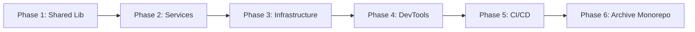

# Multi-Repo Migration Guide

This document outlines the complete strategy for migrating the SaaS Framework from a monorepo architecture to a multi-repo architecture.

## Table of Contents

- [Overview](#overview)
- [Migration Phases](#migration-phases)
- [Current State](#current-state)
- [Target Architecture](#target-architecture)
- [Phase 1: Shared Library (CURRENT)](#phase-1-shared-library-current)
- [Phase 2: Service Repositories](#phase-2-service-repositories)
- [Phase 3: Infrastructure Repository](#phase-3-infrastructure-repository)
- [Phase 4: DevTools Repository](#phase-4-devtools-repository)
- [Phase 5: CI/CD Updates](#phase-5-cicd-updates)
- [Phase 6: Monorepo Sunset](#phase-6-monorepo-sunset)
- [Migration Timeline](#migration-timeline)
- [Rollback Strategy](#rollback-strategy)
- [FAQs](#faqs)

## Overview

### Why Multi-Repo?

**Current Pain Points:**
- Single CI/CD pipeline builds all services even when only one changes
- Tight coupling between services makes independent releases difficult
- Large repository size slows down clone and operations
- Difficult to manage different access levels per service
- Git history becomes cluttered with unrelated changes

**Benefits of Multi-Repo:**
- ✅ **Independent Deployments** - Deploy services independently without affecting others
- ✅ **Faster CI/CD** - Only build and test what changed
- ✅ **Clear Ownership** - Teams own specific repositories
- ✅ **Granular Access Control** - Control who can access what
- ✅ **Focused Git History** - Clean, service-specific commit history
- ✅ **Independent Versioning** - Each service has its own version
- ✅ **Easier Scaling** - Add services without affecting existing ones

### Migration Strategy

We will use a **phased approach** to minimize disruption:
1. Create shared library (keeps monorepo working)
2. Create service repositories (parallel development possible)
3. Create infrastructure repository
4. Create devtools repository
5. Update CI/CD pipelines
6. Archive monorepo

## Migration Phases



## Current State

### Monorepo Structure
```
saas-framework-go/
├── services/
│   ├── api-gateway/
│   ├── auth-service/
│   ├── user-service/
│   ├── tenant-service/
│   ├── notification-service/
│   └── system-config-service/
├── pkg/                    # Shared packages
├── k8s/                    # Kubernetes manifests
├── helm/                   # Helm charts
├── scripts/                # Development scripts
├── docs/                   # Documentation
└── docker-compose.yml      # Local development
```

### Current Dependencies
- All services depend on `github.com/longvhv/saas-framework-go/pkg`
- Services can import from each other (tight coupling)
- Shared infrastructure configuration

## Target Architecture

### New Repository Structure

```
┌─────────────────────────────────────────────────────────────┐
│                    go-shared                                │
│  (Shared Go libraries - versioned as Go module)             │
│  - auth, config, logger, mongodb, redis, etc.               │
└─────────────────────────────────────────────────────────────┘
                              ▲
                              │ depends on
                              │
            ┌─────────────────┴─────────────────┐
            │                                    │
┌───────────▼──────────┐            ┌───────────▼──────────┐
│  saas-api-gateway    │            │  saas-auth-service   │
│  - Standalone repo   │            │  - Standalone repo   │
│  - Own CI/CD         │            │  - Own CI/CD         │
└──────────────────────┘            └──────────────────────┘
            │                                    │
            └─────────────────┬─────────────────┘
                              │
            ┌─────────────────┴─────────────────┐
            │                                    │
┌───────────▼──────────┐            ┌───────────▼──────────┐
│  saas-user-service   │            │ saas-tenant-service  │
│  - Standalone repo   │            │  - Standalone repo   │
│  - Own CI/CD         │            │  - Own CI/CD         │
└──────────────────────┘            └──────────────────────┘
            │                                    │
            └─────────────────┬─────────────────┘
                              │
            ┌─────────────────┴─────────────────┐
            │                                    │
┌───────────▼────────────────┐      ┌──────────▼───────────────┐
│ saas-notification-service  │      │saas-system-config-service│
│  - Standalone repo         │      │  - Standalone repo       │
│  - Own CI/CD               │      │  - Own CI/CD             │
└────────────────────────────┘      └──────────────────────────┘

┌─────────────────────────────────────────────────────────────┐
│                   saas-infrastructure                        │
│  (Kubernetes, Helm, Terraform, deployment configs)           │
└─────────────────────────────────────────────────────────────┘

┌─────────────────────────────────────────────────────────────┐
│                      saas-devtools                           │
│  (Development tools, scripts, docker-compose)                │
└─────────────────────────────────────────────────────────────┘
```

### Repository Mapping

| Repository | Contents | Owner |
|-----------|----------|-------|
| `go-shared` | Shared Go libraries | Platform Team |
| `saas-api-gateway` | API Gateway service | Gateway Team |
| `saas-auth-service` | Authentication service | Auth Team |
| `saas-user-service` | User management service | User Team |
| `saas-tenant-service` | Tenant management service | Tenant Team |
| `saas-notification-service` | Notification service | Notification Team |
| `saas-system-config-service` | System configuration service | Config Team |
| `saas-infrastructure` | Kubernetes, Helm, Terraform | DevOps Team |
| `saas-devtools` | Development tools and scripts | Platform Team |

## Phase 1: Shared Library (CURRENT)

**Status:** ✅ **IN PROGRESS**

### Objectives
- Extract shared packages into standalone Go module
- Maintain backward compatibility with monorepo
- Set up CI/CD for shared library

### Steps

#### 1.1 Create Repository Structure
```bash
go-shared/
├── README.md
├── LICENSE
├── CONTRIBUTING.md
├── CHANGELOG.md
├── go.mod
├── go.sum
├── .github/
│   └── workflows/
│       ├── test.yml
│       └── release.yml
├── auth/
├── config/
├── context/
├── errors/
├── httpclient/
├── jwt/
├── logger/
├── middleware/
├── mongodb/
├── rabbitmq/
├── redis/
├── response/
├── tenant/
├── utils/
└── validation/
```

#### 1.2 Update Module Path
- Change module from `github.com/longvhv/saas-framework-go/pkg` to `github.com/vhvcorp/go-shared`
- Update all internal imports within the shared library

#### 1.3 Set Up CI/CD
- GitHub Actions for testing
- GitHub Actions for releases
- Automated versioning with tags

#### 1.4 Publish Initial Version
```bash
git tag v1.0.0
git push origin v1.0.0
```

### Deliverables
- [x] `go-shared` repository created
- [x] All packages from `pkg/` copied
- [x] Import paths updated
- [x] go.mod configured
- [x] Documentation (README, CONTRIBUTING, CHANGELOG)
- [x] GitHub Actions workflows
- [x] LICENSE file

### Transition Period
During this phase, the monorepo continues to work. Services still use `github.com/longvhv/saas-framework-go/pkg`.

## Phase 2: Service Repositories

**Status:** 🟡 **IN PROGRESS** - Preparation Complete

**Timeline:** Weeks 3-8 (6 weeks, ~1 week per service)

### Objectives
- Create individual repositories for each service
- Update services to use `go-shared` module
- Maintain service functionality
- Preserve Git history during extraction

### Steps for Each Service

#### 2.1 Create Service Repository
```bash
# Example for auth-service
saas-auth-service/
├── README.md
├── LICENSE
├── CHANGELOG.md
├── Dockerfile
├── go.mod
├── go.sum
├── .github/
│   └── workflows/
│       ├── ci.yml
│       └── cd.yml
├── cmd/
│   └── main.go
├── internal/
│   ├── handlers/
│   ├── services/
│   ├── models/
│   └── repository/
├── config/
│   └── config.yaml
└── docs/
    └── API.md
```

#### 2.2 Update Dependencies
Change:
```go
import "github.com/longvhv/saas-framework-go/pkg/auth"
```

To:
```go
import "github.com/vhvcorp/go-shared/auth"
```

Update `go.mod`:
```go
module github.com/longvhv/saas-auth-service

go 1.21

require (
    github.com/vhvcorp/go-shared v1.0.0
    // other dependencies
)
```

#### 2.3 Set Up Service CI/CD
Each service gets its own CI/CD pipeline:
- Build and test on PR
- Build Docker image on merge to main
- Deploy to staging/production

#### 2.4 Service-Specific Configuration
- Environment-specific configs
- Service-specific documentation
- Independent versioning

### Services to Migrate
1. **api-gateway** → `saas-api-gateway`
2. **auth-service** → `saas-auth-service`
3. **user-service** → `saas-user-service`
4. **tenant-service** → `saas-tenant-service`
5. **notification-service** → `saas-notification-service`
6. **system-config-service** → `saas-system-config-service`

### Migration Order
1. Start with least dependent services (notification-service, system-config-service)
2. Then core services (tenant-service, auth-service)
3. Then dependent services (user-service)
4. Finally API gateway (depends on all services)

### Current Status

#### Preparation (Week 3)
- [x] Documentation structure created for all services
- [x] Extraction scripts created and ready
  - [x] extract-service.sh
  - [x] update-imports.sh
  - [x] verify-service.sh
- [x] CI/CD templates created
  - [x] ci.yml workflow
  - [x] release.yml workflow
  - [x] deploy.yml workflow
- [x] Repository templates created
  - [x] Dockerfile
  - [x] .dockerignore, .gitignore
  - [x] Makefile
  - [x] README.template.md
- [x] Service-specific documentation
  - [x] EXTRACTION_GUIDE.md for all services
  - [x] DEPENDENCIES.md for all services
  - [x] NEW_REPO_STRUCTURE.md for all services
  - [x] DEPLOYMENT.md for all services
- [x] go.mod files updated with migration notes
- [x] Phase 2 tracking document created

#### Service Extraction Status
- [ ] notification-service (Week 4) - 🔵 Not Started
- [ ] system-config-service (Week 4) - 🔵 Not Started
- [ ] tenant-service (Week 5) - 🔵 Not Started
- [ ] user-service (Week 6) - 🔵 Not Started
- [ ] auth-service (Week 7) - 🔵 Not Started
- [ ] api-gateway (Week 8) - 🔵 Not Started

### Documentation

Detailed documentation for each service extraction:
- **Main tracking:** `docs/migration/PHASE2_TRACKING.md`
- **Per-service guides:** `docs/migration/services/<service-name>/`
  - EXTRACTION_GUIDE.md - Step-by-step extraction process
  - DEPENDENCIES.md - Service dependencies and requirements
  - NEW_REPO_STRUCTURE.md - Target repository structure
  - DEPLOYMENT.md - Deployment instructions

### Extraction Tools

Located in `scripts/extract-service/`:
- **extract-service.sh** - Main extraction script with git-filter-repo
- **update-imports.sh** - Update import paths from monorepo to multi-repo
- **verify-service.sh** - Verify extracted service builds and runs
- **templates/** - CI/CD and repository file templates

## Phase 3: Infrastructure Repository

**Status:** ⏳ **PLANNED**

### Objectives
- Centralize infrastructure code
- Version infrastructure independently
- Enable infrastructure as code practices

### Repository Structure
```bash
saas-infrastructure/
├── README.md
├── CHANGELOG.md
├── kubernetes/
│   ├── base/
│   │   ├── namespace.yaml
│   │   ├── configmap.yaml
│   │   └── secrets.yaml
│   ├── services/
│   │   ├── api-gateway/
│   │   ├── auth-service/
│   │   └── ...
│   └── ingress/
├── helm/
│   └── saas-framework/
│       ├── Chart.yaml
│       ├── values.yaml
│       ├── values-dev.yaml
│       ├── values-staging.yaml
│       ├── values-prod.yaml
│       └── templates/
├── terraform/
│   ├── aws/
│   ├── gcp/
│   └── azure/
├── monitoring/
│   ├── prometheus/
│   └── grafana/
└── scripts/
    ├── deploy.sh
    └── rollback.sh
```

### Deliverables
- Kubernetes manifests for all services
- Helm charts for deployment
- Terraform modules for cloud resources
- Monitoring configurations
- Deployment scripts

## Phase 4: DevTools Repository

**Status:** ⏳ **PLANNED**

### Objectives
- Centralize development tools
- Provide easy local development setup
- Share scripts across teams

### Repository Structure
```bash
saas-devtools/
├── README.md
├── docker-compose.yml
├── docker-compose.dev.yml
├── .env.example
├── scripts/
│   ├── setup.sh
│   ├── seed_db.sh
│   ├── reset_db.sh
│   └── load-test.sh
├── tools/
│   ├── mock-servers/
│   └── data-generators/
├── config/
│   └── development/
└── docs/
    └── LOCAL_SETUP.md
```

### Contents
- Docker Compose for local development
- Database seeding scripts
- Development tools and utilities
- Mock servers for testing
- Load testing tools

## Phase 5: CI/CD Updates

**Status:** ⏳ **PLANNED**

### Objectives
- Set up CI/CD for each repository
- Implement GitOps workflows
- Enable automated deployments

### Per-Repository CI/CD

#### Shared Library (`go-shared`)
```yaml
# .github/workflows/test.yml
- Lint on PR
- Test on PR
- Coverage reporting

# .github/workflows/release.yml
- Run tests
- Create GitHub release on tag
- Publish to Go proxy
```

#### Service Repositories
```yaml
# .github/workflows/ci.yml
- Lint and test on PR
- Build Docker image
- Run integration tests

# .github/workflows/cd.yml
- Build and push Docker image on merge
- Update Kubernetes manifests
- Deploy to staging
- Run smoke tests
- Deploy to production (with approval)
```

#### Infrastructure Repository
```yaml
# .github/workflows/deploy.yml
- Validate manifests
- Run Terraform plan
- Apply changes (with approval)
```

### Deployment Strategy
- **Development**: Auto-deploy from `develop` branch
- **Staging**: Auto-deploy from `main` branch
- **Production**: Manual approval required

## Phase 6: Monorepo Sunset

**Status:** ⏳ **PLANNED**

### Objectives
- Archive monorepo
- Update documentation
- Redirect developers to new repositories

### Steps

#### 6.1 Verify Migration Complete
- [ ] All services running from new repositories
- [ ] CI/CD pipelines operational
- [ ] Documentation updated
- [ ] Teams trained on new workflow

#### 6.2 Archive Monorepo
```bash
# Add README to archived repo
cat > README.md << EOF
# ARCHIVED - SaaS Framework Go Monorepo

This repository has been archived and split into multiple repositories.

## New Repositories

- Shared Library: https://github.com/vhvcorp/go-shared
- API Gateway: https://github.com/longvhv/saas-api-gateway
- Auth Service: https://github.com/longvhv/saas-auth-service
- User Service: https://github.com/longvhv/saas-user-service
- Tenant Service: https://github.com/longvhv/saas-tenant-service
- Notification Service: https://github.com/longvhv/saas-notification-service
- System Config Service: https://github.com/longvhv/saas-system-config-service
- Infrastructure: https://github.com/longvhv/saas-infrastructure
- DevTools: https://github.com/longvhv/saas-devtools

For historical reference only. Do not use this repository for new development.
EOF

git commit -am "Archive repository - migrated to multi-repo"
git push
```

#### 6.3 Archive on GitHub
- Go to repository settings
- Scroll to "Danger Zone"
- Click "Archive this repository"

#### 6.4 Update Documentation
- Update all links to point to new repositories
- Update onboarding guides
- Update deployment documentation

## Migration Timeline

| Phase | Duration | Start Date | End Date |
|-------|----------|------------|----------|
| Phase 1: Shared Library | 2 weeks | Week 1 | Week 2 |
| Phase 2: Service Repos | 4 weeks | Week 3 | Week 6 |
| Phase 3: Infrastructure | 2 weeks | Week 7 | Week 8 |
| Phase 4: DevTools | 1 week | Week 9 | Week 9 |
| Phase 5: CI/CD Updates | 2 weeks | Week 10 | Week 11 |
| Phase 6: Monorepo Sunset | 1 week | Week 12 | Week 12 |

**Total Duration:** ~12 weeks (3 months)

## Rollback Strategy

### If Issues Arise

#### During Phase 1-2
- Monorepo remains functional
- Can continue using monorepo while fixing issues
- No production impact

#### During Phase 3-5
- Keep monorepo CI/CD active
- Can revert to monorepo deployments
- New repositories can be deleted if needed

#### After Phase 6
- Unarchive monorepo if critical issues found
- Requires more effort but possible

### Rollback Checklist
- [ ] Identify issue and severity
- [ ] Communicate to all teams
- [ ] Revert recent changes
- [ ] Restore monorepo workflows
- [ ] Analyze root cause
- [ ] Create fix plan

## FAQs

### General Questions

**Q: Will this affect production services?**
A: No. Migration is designed to be zero-downtime. Production continues running from monorepo until we're ready to switch.

**Q: How long will migration take?**
A: Approximately 12 weeks for complete migration.

**Q: Can we do partial migration?**
A: Yes. Each phase is independent. We can migrate services gradually.

### Technical Questions

**Q: How do we update shared library?**
A: Update version in service's `go.mod`:
```bash
go get github.com/vhvcorp/go-shared@v1.1.0
```

**Q: What about breaking changes in shared library?**
A: Shared library follows semantic versioning. Breaking changes increment major version. Services can choose when to upgrade.

**Q: How do services communicate?**
A: Services communicate via REST APIs (as before). The change is organizational, not architectural.

**Q: What about shared configuration?**
A: Shared configs move to `saas-infrastructure` repository. Services reference them via ConfigMaps/Secrets.

**Q: How do we test across services locally?**
A: Use `saas-devtools` repository with Docker Compose that references all services.

### Workflow Questions

**Q: Where do I make changes to shared code?**
A: In `go-shared` repository. Release new version, then update services.

**Q: Where do I change service code?**
A: In the service's repository (e.g., `saas-auth-service`).

**Q: Where do I change deployment configs?**
A: In `saas-infrastructure` repository.

**Q: How do I deploy a single service?**
A: Each service has its own CI/CD. Push to service repository triggers deployment.

**Q: How do I deploy all services?**
A: Use `saas-infrastructure` repository deployment scripts.

### Migration Questions

**Q: Do I need to migrate my feature branch?**
A: Wait until after service is migrated, then create branch in new repository.

**Q: What happens to monorepo PRs?**
A: Complete in-flight PRs before migration. New work goes to new repositories.

**Q: Will git history be preserved?**
A: Yes, git history will be preserved in new repositories using `git filter-branch` or similar tools.

## Getting Help

### Resources
- Main documentation: This file
- Shared library docs: https://github.com/vhvcorp/go-shared
- Slack channel: #multi-repo-migration
- Weekly sync meetings: Thursdays 2pm

### Contacts
- **Migration Lead**: [Name]
- **Platform Team**: [Names]
- **DevOps Team**: [Names]

## Success Criteria

Migration is considered successful when:
- [x] All repositories created and documented
- [ ] All services running from new repositories
- [ ] CI/CD pipelines operational for all repositories
- [ ] No production incidents related to migration
- [ ] Teams trained and comfortable with new workflow
- [ ] Monorepo archived
- [ ] Documentation updated and complete

---

**Last Updated:** 2024-12-25
**Version:** 1.0
**Status:** Phase 1 In Progress
